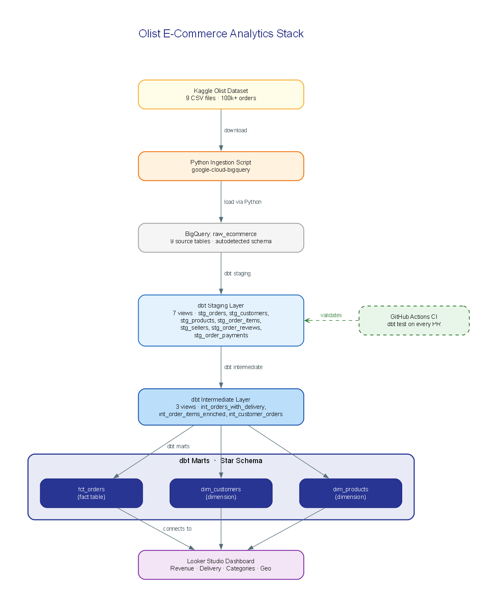
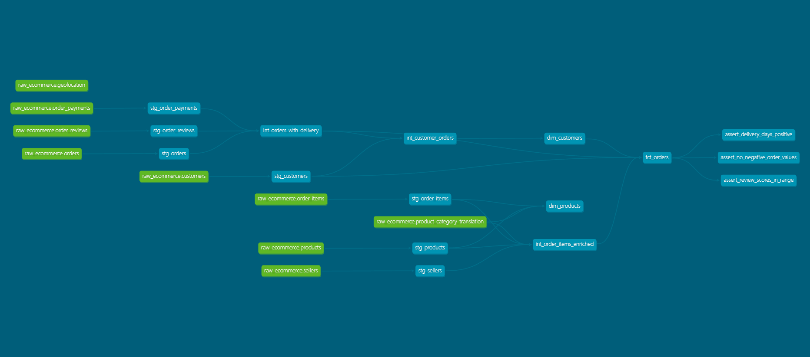
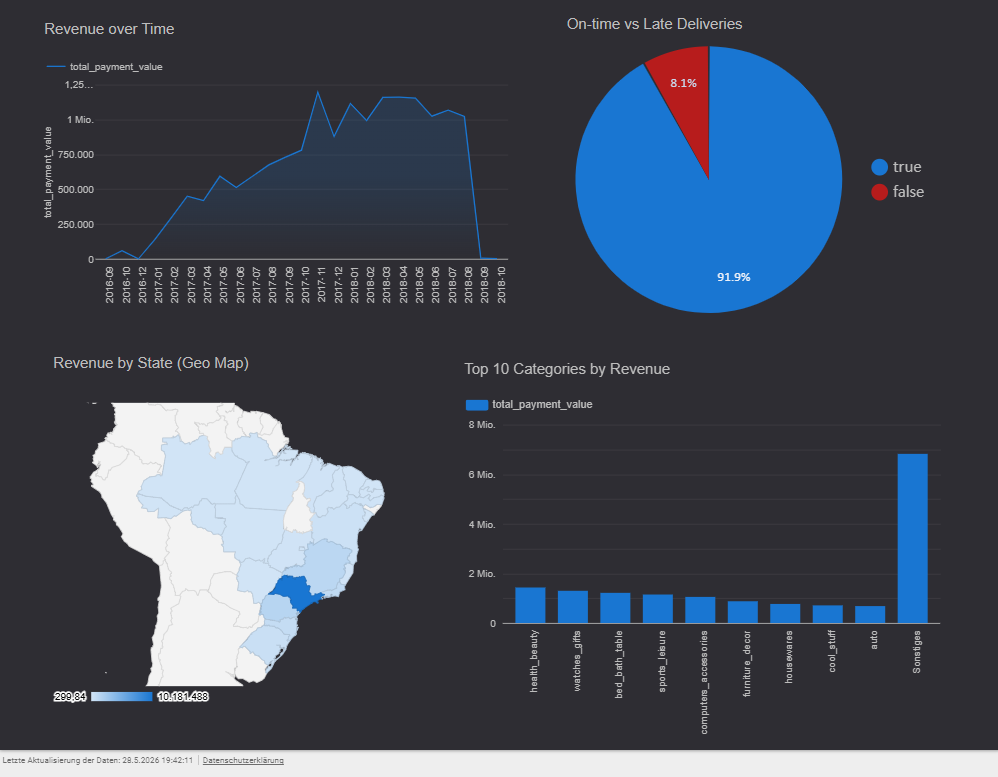

# Olist E-Commerce Analytics Stack

### Production-grade Analytics Engineering on 100k+ Brazilian e-commerce orders

<div align="center">


[](https://github.com/adhishnanda/ecommerce-dbt-stack/actions/workflows/ci.yml)


**[Live Looker Studio Dashboard →](https://datastudio.google.com/reporting/16a27174-33bf-4c1f-a222-6c61aa67cde1)**

</div>

<div align="center">

`dbt` · `BigQuery` · `Analytics Engineering` · `Kimball` · `Star Schema` · `SQL` · `Python` · `GitHub Actions`

</div>

---

## Overview

This project implements a full Analytics Engineering stack on the [Olist Brazilian E-Commerce dataset](https://www.kaggle.com/datasets/olistbr/brazilian-ecommerce) — a real-world dataset of 100k+ orders placed across a Brazilian marketplace between 2016 and 2018. Raw CSV data is ingested into BigQuery and transformed through a three-layer dbt pipeline into a Kimball star schema, backed by 94 automated data quality tests and a CI/CD pipeline that validates every pull request. The result is a production-ready analytical foundation surfaced through a Looker Studio dashboard covering delivery performance, customer segmentation, revenue attribution, and product analytics.

---

## Architecture

<div align="center">



</div>

---

## Model Lineage (DAG)

<div align="center">



</div>

> Generated by `dbt docs generate && dbt docs serve`.
> Shows the full dependency graph from raw sources through
> staging → intermediate → marts.

---

## Dashboard Preview

<div align="center">



</div>

> [Open live dashboard →](https://datastudio.google.com/reporting/16a27174-33bf-4c1f-a222-6c61aa67cde1)

---

## Star Schema

The marts layer implements a **Kimball star schema**. All three models are materialised as BigQuery tables, enabling fast aggregations without repeated view chaining.

### `fct_orders` — fact table, one row per order

The central analytical table. Every order is enriched with customer keys, date dimensions, payment totals, delivery performance metrics, review scores, item rollups, and geographic attributes.

Key columns: `order_id` · `customer_key` · `order_date` · `order_year_month` · `order_status` · `total_payment_value` · `payment_types` · `avg_review_score` · `days_to_delivery` · `delivery_delay_days` · `delivered_on_time` · `item_count` · `total_items_value` · `customer_state` · `customer_state_full` · `seller_state` · `seller_state_full` · `primary_category` · `categories_ordered`

### `dim_customers` — one row per unique shopper

Built from lifetime order history. Includes RFM-style segments computed directly in dbt.

Key columns: `customer_key` · `customer_unique_id` · `total_orders` · `lifetime_value` · `avg_order_value` · `avg_satisfaction_score` · `acquisition_cohort` · `value_segment` (`High Value` / `Mid Value` / `Low Value`) · `loyalty_segment` (`Repeat` / `Returning` / `One-Time`)

### `dim_products` — one row per product listing

Enriched with translated English category names, average selling price, and order frequency derived from historical transactions.

Key columns: `product_key` · `product_id` · `product_category_name_english` · `product_weight_g` · `avg_selling_price` · `times_ordered`

---

## Key Business Insights

| Metric | Value |
|---|---|
| Orders delivered on time | **91.9%** |
| Orders delivered late | **8.1%** |
| Top revenue category | **Health & Beauty** |
| Top revenue state | **São Paulo** |
| Revenue trend | Consistent growth, 2016 → mid-2018 |

- **Delivery performance** is computed per order using a signed `delivery_delay_days` field (positive = late, negative = early). The `delivered_on_time` boolean enables direct filter-based SLA reporting in any BI tool.
- **Health & Beauty** emerges as the top-grossing category when `primary_category` (the dominant category per order, selected via `APPROX_TOP_COUNT`) is joined against `total_payment_value`.
- **São Paulo** dominates revenue across all 27 Brazilian states. `fct_orders` carries both the ISO state code (`customer_state`) and the full Portuguese name (`customer_state_full`) for compatibility with Looker Studio's geo layer.
- **Revenue growth** is visible in `order_year_month` time-series charts, with strong month-over-month growth from late 2016 through mid-2018 before the dataset's cut-off.

---

## Data Quality

**94 automated tests** are defined across all three dbt layers. Every test is run locally before merge; the CI pipeline validates the staging layer on every pull request.

| Test type | Count | What it covers |
|---|---|---|
| `not_null` | 47 | All primary keys, foreign keys, and timestamp columns |
| `unique` | 12 | `order_id`, `customer_key`, `product_id`, `seller_id`, and others |
| `accepted_values` | 8 | `order_status` (8 values), `payment_type` (5 values), `review_score` (1–5), Brazilian state codes |
| `relationships` | 1 | `fct_orders.customer_key` → `dim_customers.customer_key` (FK integrity) |
| `dbt_utils.unique_combination_of_columns` | 3 | Composite PKs: `(order_id, order_item_id)`, `(order_id, payment_sequential)`, `fct_orders` grain |
| Singular tests | 3 | No negative order values · Delivery days ≥ 0 for delivered orders · Review scores within 1–5 |
| Source tests | 20 | `not_null` and `unique` directly on all 9 raw BigQuery tables |

### CI Pipeline

Every pull request to `main` triggers the GitHub Actions workflow (`.github/workflows/ci.yml`):

1. Spins up a clean Ubuntu runner with Python 3.11
2. Installs `dbt-bigquery==1.11.1`
3. Writes BigQuery credentials from a GitHub secret
4. Runs `dbt deps` → `dbt debug` → `dbt compile` → `dbt test --select staging`

Staging-only testing in CI keeps runs under 60 seconds and BigQuery costs at zero (read-only queries against source tables with no writes).

---

## Technical Stack

| Layer | Technology |
|---|---|
| Data Warehouse | BigQuery (europe-west10, Berlin — GDPR compliant) |
| Transformation | dbt Core 1.11 |
| Modelling Pattern | Kimball Star Schema |
| Testing | dbt generic + singular tests (94 total) |
| CI/CD | GitHub Actions |
| Visualisation | Looker Studio |
| Language | SQL, Python 3.11 |
| Version Control | Git + GitHub |

> All data is stored and processed in **europe-west10 (Berlin, Germany)**. No data leaves the EU region. This satisfies GDPR data residency requirements for organisations operating under European data protection law.

---

## Running Locally

### Prerequisites

- Python 3.11
- A Google Cloud project with BigQuery enabled
- A service account key file with `BigQuery Data Editor` and `BigQuery Job User` roles

### Setup

```bash
# Clone the repository
git clone https://github.com/adhishnanda/ecommerce-dbt-stack.git
cd ecommerce-dbt-stack

# Create and activate a virtual environment
python -m venv venv
source venv/bin/activate         # macOS/Linux
venv\Scripts\activate            # Windows

# Install dbt
pip install dbt-bigquery==1.11.1
```

### Configure BigQuery credentials

Create `~/.dbt/profiles.yml`:

```yaml
ecommerce_dbt:
  outputs:
    dev:
      type: bigquery
      method: service-account
      project: ecommerce-dbt-stack
      dataset: ecommerce_dbt
      location: europe-west10
      keyfile: ~/.dbt/bq-credentials.json
      threads: 4
      job_execution_timeout_seconds: 300
  target: dev
```

Place your service account JSON key at `~/.dbt/bq-credentials.json`.

### Build and test

```bash
dbt deps                              # install dbt_utils package
dbt run                               # build all 13 models
dbt test                              # run all 94 tests
dbt build                             # run + test in one command

dbt run --select staging              # staging layer only
dbt test --select marts               # mart tests only
dbt build --select +fct_orders        # fct_orders and all upstream deps

dbt docs generate && dbt docs serve   # interactive lineage documentation
```

---

## Project Structure

```
ecommerce-dbt-stack/
│
├── models/
│   ├── staging/                      # 7 views — source cleanup only
│   │   ├── sources.yml               # 9 source table definitions + tests
│   │   ├── stg_orders.sql/yml
│   │   ├── stg_customers.sql/yml
│   │   ├── stg_order_items.sql/yml
│   │   ├── stg_products.sql/yml
│   │   ├── stg_sellers.sql/yml
│   │   ├── stg_order_reviews.sql/yml
│   │   └── stg_order_payments.sql/yml
│   │
│   ├── intermediate/                 # 3 views — business logic and joins
│   │   ├── int_order_items_enriched.sql
│   │   ├── int_orders_with_delivery.sql/yml
│   │   └── int_customer_orders.sql
│   │
│   └── marts/                        # 3 tables — star schema for BI
│       ├── fct_orders.sql/yml
│       ├── dim_customers.sql/yml
│       └── dim_products.sql
│
├── tests/                            # singular data quality tests
│   ├── assert_no_negative_order_values.sql
│   ├── assert_delivery_days_positive.sql
│   └── assert_review_scores_in_range.sql
│
├── macros/
│   ├── safe_divide.sql               # null-safe division
│   └── is_weekday.sql                # Monday–Friday date check
│
├── .github/
│   └── workflows/
│       └── ci.yml                    # GitHub Actions CI
│
├── dbt_project.yml
├── packages.yml                      # dbt_utils ≥1.0.0
├── DECISIONS.md                      # full design decision log
└── CLAUDE.md                         # project context
```

---

## Design Decisions

Full reasoning is documented in [`DECISIONS.md`](DECISIONS.md). Three choices worth calling out:

**Why star schema over wide tables**
A single wide table joining all dimensions would be simpler to build but expensive to query, every scan reads columns irrelevant to the current question. The star schema separates facts (what happened) from dimensions (who and what was involved), enabling BigQuery to prune columns efficiently and allowing BI tools to join only what they need. It also maps directly to how business questions are phrased: *"how much did High Value customers spend last quarter?"* is a natural join of `fct_orders` and `dim_customers`.

**Why three layers instead of staging directly to marts**
The intermediate layer exists because business logic is reused. Delivery delay calculations, payment aggregations, and customer lifetime metrics are each needed by multiple downstream models. Defining them once in `int_orders_with_delivery` and `int_customer_orders` means a single source of truth, change the logic in one place and it propagates everywhere. Without this layer, the same logic would be copy-pasted into every mart and would inevitably diverge.

**Why views for staging/intermediate and tables for marts**
Staging and intermediate models are lightweight transformations over source tables that BigQuery already stores. Materialising them as views means zero storage cost and always-fresh data with no incremental logic needed. Marts are materialised as tables because they are the query target for Looker Studio, which executes aggregations over 99k+ rows - a physical table eliminates repeated view chaining and keeps dashboard load times fast.

---

## Author

**Adhish Nanda**

[](https://linkedin.com/in/adhishnanda)
[](https://github.com/adhishnanda)
